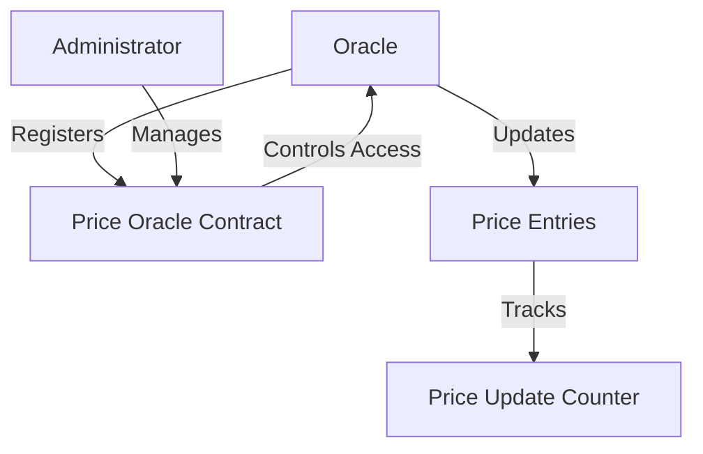

# Serialize Price

A decentralized price oracle smart contract built on the Stacks blockchain, designed to provide secure, verifiable, and tamper-resistant price serialization for digital assets and financial instruments.

## Overview

Serialize Price is a decentralized oracle platform that enables secure, transparent, and precise price tracking across multiple digital assets. By leveraging the Stacks blockchain's robust infrastructure, this project provides a reliable mechanism for price data serialization with controlled oracle access and comprehensive update tracking.

### Key Features

- Decentralized price tracking
- Controlled oracle registration
- Multi-symbol price support
- Precision-enabled price entries
- Comprehensive update logging
- Source attribution for price data

## Architecture

The system is built around a core smart contract that manages oracle registrations, price entries, and update tracking. The architecture follows a controlled oracle-based model with two primary actors: oracles and contract administrators.



### Core Components

1. **Oracle Management**
   - Oracle registration
   - Active oracle tracking
   - Role-based access control

2. **Price Serialization**
   - Multi-symbol price storage
   - Decimal precision support
   - Source tracking for price entries

3. **Update Tracking**
   - Comprehensive price update logging
   - Immutable update records
   - Total update count tracking

## Contract Documentation

### Price Oracle Contract

The primary contract (`price-oracle.clar`) handles core price serialization functionality:

#### Key Functions

**Oracle Operations**
- `register-oracle`: Register as a price oracle
- `update-price`: Update price for a specific symbol

**Read Operations**
- `get-price`: Retrieve current price for a symbol
- `check-oracle-status`: Check oracle registration
- `get-price-update-count`: Get total price updates

## Getting Started

### Prerequisites

- Clarinet CLI
- Stacks wallet
- Node.js

### Installation

1. Clone the repository
```bash
git clone <repository-url>
cd serialize-price
```

2. Install dependencies
```bash
clarinet install
```

3. Run tests
```bash
clarinet test
```

## Function Reference

### Oracle Functions

```clarity
(register-oracle)
```
Registers the caller as a price oracle.

```clarity
(update-price 
  (symbol (string-utf8 10)) 
  (new-price uint)
  (decimals uint)
  (source (string-utf8 50))
)
```
Updates the price for a given symbol with precision and source details.

### Read Functions

```clarity
(get-price (symbol (string-utf8 10)))
```
Retrieves the current price entry for a symbol.

## Development

### Testing

The contract includes comprehensive test scenarios:

1. Oracle registration
2. Price update mechanisms
3. Access control verification
4. Price retrieval validation

### Local Development

1. Start Clarinet console:
```bash
clarinet console
```

2. Deploy contract:
```bash
clarinet deploy
```

## Security Considerations

### Oracle Access
- Controlled oracle registration
- Explicit oracle validation
- No unauthorized price updates

### Price Data
- Immutable price update tracking
- Source attribution
- Minimal on-chain storage

### Known Limitations
- Symbol name length restricted to 10 characters
- Single decimal precision per symbol
- No automatic price validation

## Future Roadmap

- Advanced oracle reputation system
- Cross-chain price synchronization
- More complex price aggregation
- Enhanced decimal precision support